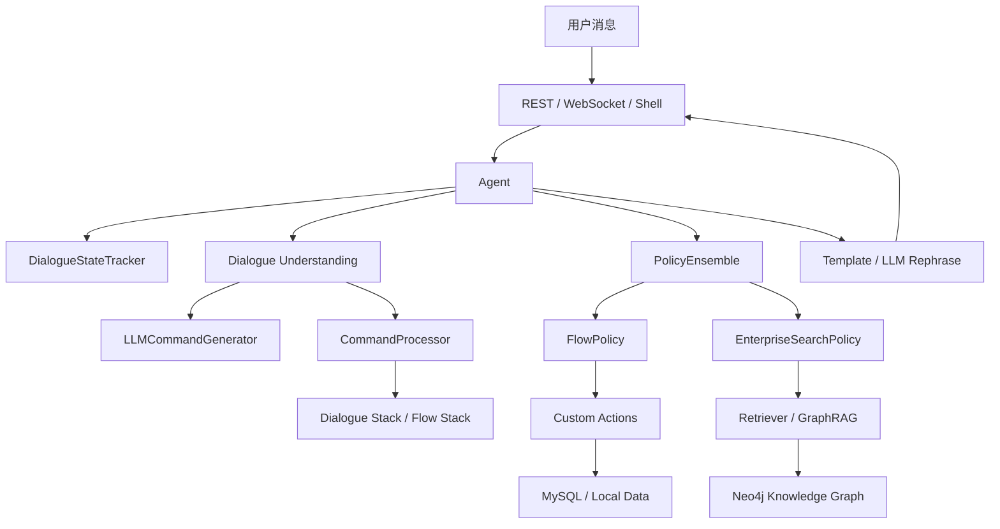

# LLM Customer Service

一个面向教学和原型验证的 LLM 智能客服框架。提供对话状态管理、Flow 流程编排、LLM 指令生成、策略选择、RAG/GraphRAG 检索增强、REST/WebSocket 服务以及命令行工具。仓库中的 `ecs_demo` 是一个电商客服示例，覆盖订单、物流、售后和商品知识检索等典型场景。

> 注意：请不要提交 `.env`、`neo4j.dump`、`__pycache__`、`*.pyc`、`*.egg-info` 等本地密钥、数据导出和生成文件。运行项目时请基于 `ecs_demo/.env.example` 自行配置本地环境变量。

## 目录

- [项目特点](#项目特点)
- [系统架构](#系统架构)
- [目录结构](#目录结构)
- [环境要求](#环境要求)
- [安装](#安装)
- [环境变量配置](#环境变量配置)
- [运行电商客服 Demo](#运行电商客服-demo)
- [命令行工具](#命令行工具)
- [API 接口](#api-接口)
- [配置文件说明](#配置文件说明)
- [电商 Demo 能力](#电商-demo-能力)
- [GraphRAG 与数据准备](#graphrag-与数据准备)
- [二次开发](#二次开发)
- [安全说明](#安全说明)
- [常见问题](#常见问题)

## 项目特点

- **LLM 驱动的对话理解**：通过 `LLMCommandGenerator` 将用户自然语言转换为可执行命令，如槽位填充、Flow 启动、回答等。
- **Flow 流程编排**：使用 YAML 定义业务流程，支持 `collect`、`action`、`set_slots`、条件分支和 `END` 结束节点。
- **领域模型 Domain**：统一管理槽位、回复模板和自定义 Action 声明。
- **策略系统**：内置 `FlowPolicy` 和 `EnterpriseSearchPolicy`，可优先执行业务流程，并在流程无法命中时进入知识检索或兜底回答。
- **GraphRAG 检索增强**：示例中基于 Neo4j 知识图谱、混合检索和 LLM 生成 Cypher 查询，为商品知识问答提供支持。
- **多通道服务**：提供 FastAPI REST API、WebSocket 流式通道和浏览器调试页。
- **可安装 CLI**：安装后可使用 `init/train/run/shell/inspect/export` 等命令。
- **教学友好**：代码模块划分清晰，适合学习对话系统、LLM Agent、流程机器人和 RAG 客服系统的核心设计。

## 系统架构



核心处理链路：

1. 用户通过 REST、WebSocket 或命令行 Shell 输入消息。
2. `Agent` 加载 Domain、Flows、Actions、Endpoints 和策略配置。
3. `LLMCommandGenerator` 识别用户意图并生成对话命令。
4. `CommandProcessor` 更新槽位、对话栈和 Flow 状态。
5. `PolicyEnsemble` 决定下一步动作：执行业务 Flow、调用检索策略或兜底。
6. 自定义 `Action` 查询数据库、更新订单或返回候选按钮。
7. NLG 模块生成最终回复。

## 目录结构

```text
.
├── agent_ai/                     # 框架核心 Python 包
│   ├── agent/                      # Agent、消息处理、LangGraph 节点
│   ├── api/                        # FastAPI 服务与调试页
│   ├── channels/                   # REST、SocketIO、Console 通道抽象
│   ├── cli/                        # 命令行工具
│   ├── core/                       # Domain、Slot、Tracker、Store
│   ├── dialogue_understanding/     # 命令生成、命令解析、Flow 执行、对话栈
│   ├── nlg/                        # 回复生成与重述
│   ├── policies/                   # FlowPolicy、EnterpriseSearchPolicy 等策略
│   ├── retrieval/                  # 检索增强基础接口与向量化器
│   ├── shared/                     # 配置、常量、异常、YAML 读取
│   └── training/                   # 训练/校验/模型打包
├── ecs_demo/                       # 电商客服示例项目
│   ├── actions/                    # 订单、物流、售后自定义动作
│   ├── addons/                     # GraphRAG 与索引构建示例
│   ├── data/flows/                 # 业务 Flow 定义
│   ├── domain/                     # Domain 定义
│   ├── config.yml                  # Pipeline 与 Policy 配置
│   ├── endpoints.yml               # LLM、Neo4j、MySQL 等端点配置
│   └── .env.example                # 环境变量示例
├── ecs.sql                         # MySQL 示例库建表与初始化数据
├── requirements.txt                # 依赖列表
├── setup.py                        # Python 包安装配置
```

## 环境要求

- Python 3.10 或以上
- pip
- 可选：MySQL 8.x，用于订单、物流、售后示例动作
- 可选：Neo4j 5.x，用于 GraphRAG 知识图谱检索
- 可选：DashScope / OpenAI / Azure OpenAI / Anthropic 等 LLM 服务

依赖中包含 `torch`、`sentence-transformers`、`neo4j-graphrag` 等较大的包，首次安装可能耗时较久。

## 安装

推荐使用虚拟环境：

```powershell
cd D:\Github\llm_customer_service
python -m venv .venv
.\.venv\Scripts\activate
python -m pip install --upgrade pip
pip install -e . -i https://pypi.tuna.tsinghua.edu.cn/simple
```

如果不希望以可编辑模式安装，也可以只安装依赖：

```powershell
pip install -r requirements.txt -i https://pypi.tuna.tsinghua.edu.cn/simple
```


## 环境变量配置

复制示例文件：

```powershell
copy ecs_demo\.env.example ecs_demo\.env
```

然后根据本地环境填写 `ecs_demo/.env`：

```env
DASHSCOPE_API_KEY=<your_dashscope_api_key>
NEO4J_URI=bolt://localhost:7687
NEO4J_USER=<your_neo4j_user>
NEO4J_PASSWORD=<your_neo4j_password>
MYSQL_HOST=localhost
MYSQL_PORT=3306
MYSQL_DATABASE=ecs
MYSQL_USER=<your_mysql_user>
MYSQL_PASSWORD=<your_mysql_password>
EMBEDDING_MODEL=./models/bge-base-zh-v1.5
```

说明：

- `DASHSCOPE_API_KEY`：示例默认使用通义千问 DashScope。
- `NEO4J_*`：GraphRAG 连接 Neo4j 使用。
- `MYSQL_*`：电商订单、物流、售后动作连接 MySQL 使用。
- `EMBEDDING_MODEL`：本地向量模型路径；如果使用 `sentence-transformers`，需要准备对应模型文件。

`.env` 用于保存本地真实密钥，请不要提交到 GitHub。

## 运行电商客服 Demo

### 1. 准备 MySQL 示例库

创建数据库和示例数据：

```powershell
mysql -u <your_mysql_user> -p < ecs.sql
```

如果你修改了数据库名，需要同步修改 `ecs_demo/.env` 中的 `MYSQL_DATABASE`。

### 2. 准备环境变量

```powershell
cd D:\Github\llm_customer_service\ecs_demo
copy .env.example .env
```

编辑 `.env`，填入 LLM、MySQL 和 Neo4j 配置。

### 3. 校验并打包模型

```powershell
cd D:\Github\llm_customer_service\ecs_demo
train --dry-run
```

训练命令在本项目中的主要作用是校验 Domain、Flows 和配置，并打包可运行的模型文件。由于系统主要由 LLM 和 YAML 流程驱动，并不是传统意义上的神经网络训练。

### 4. 启动服务

```powershell
cd D:\Github\llm_customer_service\ecs_demo
run --model . --port 5005 --enable-inspect
```

启动后可访问：

- API 文档：`http://localhost:5005/docs`
- 调试页面：`http://localhost:5005/inspect`
- 健康检查：`http://localhost:5005/health`

### 5. 命令行对话测试

```powershell
cd D:\Github\llm_customer_service\ecs_demo
shell --model .
```

可以尝试输入：

- 查询我的订单
- 修改订单收货地址
- 取消订单
- 查询物流信息
- 有哪些快递公司
- 我要申请售后
- 推荐一些手机商品

## API 接口

启动服务后，默认提供以下接口。

### 健康检查

```http
GET /health
```

返回示例：

```json
{
  "status": "ok",
  "version": "0.1.0",
  "agent_ready": true
}
```

### 发送消息

```http
POST /api/messages
```

请求示例：

```json
{
  "sender": "user_001",
  "message": "帮我查询订单详情",
  "metadata": {}
}
```

返回示例：

```json
[
  {
    "recipient_id": "user_001",
    "text": "请选择要查询的订单",
    "buttons": [],
    "image": null,
    "custom": null
  }
]
```

### 获取会话状态

```http
GET /api/sessions/{session_id}
GET /api/tracker/{session_id}/full
```

### 重置会话

```http
POST /api/sessions/{session_id}/reset
```

### 获取 Domain 和 Flows

```http
GET /api/domain
GET /api/flows
```

### WebSocket

```text
ws://localhost:5005/api/stream
```

连接后可发送：

```json
{
  "type": "connect",
  "session_id": "user_001"
}
```

发送消息：

```json
{
  "type": "message",
  "sender_id": "user_001",
  "message": "查询物流"
}
```

## 配置文件说明

### `ecs_demo/config.yml`

定义对话系统的 Pipeline 和 Policy：

```yaml
recipe: default.v1
language: zh

pipeline:
  - name: LLMCommandGenerator
    llm: default

policies:
  - name: FlowPolicy
  - name: EnterpriseSearchPolicy
    llm: default
    vector_store: addons.information_retrieval.GraphRAG
```

含义：

- `LLMCommandGenerator` 使用 `endpoints.yml` 中名为 `default` 的模型。
- `FlowPolicy` 负责命中并执行业务流程。
- `EnterpriseSearchPolicy` 在流程外提供知识检索、RAG 和兜底策略。
- `vector_store` 指向自定义检索器类，本 demo 使用 `ecs_demo/addons/information_retrieval.py` 中的 `GraphRAG`。

### `ecs_demo/endpoints.yml`

定义外部服务：

```yaml
models:
  default:
    type: qwen
    model: qwen-plus
    api_key: ${DASHSCOPE_API_KEY}
    temperature: 0.1

vector_store:
  uri: "${NEO4J_URI:bolt://localhost:7687}"
  user: "${NEO4J_USER}"
  password: "${NEO4J_PASSWORD}"

database:
  url: "mysql+pymysql://${MYSQL_USER}:${MYSQL_PASSWORD}@${MYSQL_HOST:localhost}:${MYSQL_PORT:3306}/${MYSQL_DATABASE:ecs}"

tracker_store:
  type: memory
```

配置支持 `${VAR_NAME}` 和 `${VAR_NAME:default}` 环境变量替换。

## 电商 Demo 能力

### 订单模块

定义文件：

- `ecs_demo/domain/domain_order.yml`
- `ecs_demo/data/flows/flow_order.yml`
- `ecs_demo/actions/action_order.py`

支持能力：

- 切换用户 ID
- 查询订单详情
- 修改收货人姓名、电话、地址
- 选择已有收货信息
- 取消未发货或待支付订单
- 根据订单状态控制可执行操作

### 物流模块

定义文件：

- `ecs_demo/domain/domain_logistics.yml`
- `ecs_demo/data/flows/flow_logistics.yml`
- `ecs_demo/actions/action_logistics.py`

支持能力：

- 查询支持的快递公司
- 查询已发货订单物流信息
- 返回物流轨迹和签收状态

### 售后模块

定义文件：

- `ecs_demo/domain/domain_postsale.yml`
- `ecs_demo/data/flows/flow_postsale.yml`
- `ecs_demo/actions/action_postsale.py`

支持能力：

- 申请退货/退款或换货
- 校验订单是否满足售后条件
- 收集售后类型和售后原因
- 写入售后申请记录

### 商品知识检索

定义文件：

- `ecs_demo/addons/information_retrieval.py`
- `ecs_demo/addons/create_indexing.py`

支持能力：

- 使用 LLM 识别查询入口节点类型，如 SKU、SPU、品牌、类目、属性、用户等。
- 使用 Neo4j HybridRetriever 做全文 + 向量混合检索。
- 使用 LLM 根据图谱 Schema 生成 Cypher 查询。
- 校验和修正 Cypher 后执行查询。
- 将查询结果格式化为客服可读的自然语言回答。

## GraphRAG 与数据准备

GraphRAG 依赖 Neo4j 图数据库、本地 Embedding 模型和索引。

### 1. 准备 Neo4j 数据

如果你有 Neo4j dump 文件，可以使用 Neo4j 管理工具导入：

```powershell
neo4j-admin database load --from-path="<dump_file_directory>" --overwrite-destination=true neo4j --verbose
```

本仓库默认不提交 `neo4j.dump`，原因是 dump 文件通常体积较大，并且可能包含业务数据或个人信息。

### 2. 配置 Neo4j 连接

在 `ecs_demo/.env` 中配置：

```env
NEO4J_URI=bolt://localhost:7687
NEO4J_USER=<your_neo4j_user>
NEO4J_PASSWORD=<your_neo4j_password>
```

### 3. 准备 Embedding 模型

默认读取：

```env
EMBEDDING_MODEL=./models/bge-base-zh-v1.5
```

如果使用本地模型，请把模型文件放到对应目录，或者改成你自己的路径。

### 4. 创建 Neo4j 向量和全文索引

```powershell
cd D:\Github\llm_customer_service\ecs_demo
python .\addons\create_indexing.py
```

脚本会为 `Category1`、`Category2`、`Category3`、`Trademark`、`SPU`、`SKU`、`Attr` 等节点建立向量索引和全文索引。

## 二次开发

### 新增槽位和回复模板

在 `domain/*.yml` 中新增：

```yaml
slots:
  example_slot:
    type: text
    mappings:
      - type: from_llm

responses:
  utter_ask_example_slot:
    - text: "请提供相关信息"
```

### 新增 Flow

在 `data/flows/*.yml` 中新增：

```yaml
flows:
  example_flow:
    name: 示例流程
    description: 当用户想执行某个业务时使用
    steps:
      - collect: example_slot
      - action: action_example
        next: END
```

### 新增自定义 Action

在项目的 `actions/` 目录中新增 Python 文件，并继承 `agent_ai.agent.actions.Action`。框架会自动扫描并注册这些 Action。

示意代码：

```python


class ActionExample(Action):
    @property
    def name(self) -> str:
        return "action_example"

    async def run(self, tracker, domain, **kwargs):
        return ActionResult(responses=[{"text": "示例动作已执行"}])
```


## 安全说明

请不要把以下文件提交到 GitHub：

- `.env`
- `neo4j.dump`
- 数据库 dump
- 本地模型目录 `models/`
- Python 缓存 `__pycache__/`、`*.pyc`
- 构建产物 `*.egg-info/`、`build/`、`dist/`
- 私钥、证书、访问令牌

如果仓库中保留 `.gitignore`，建议忽略这些内容。提交前建议执行：

```powershell
git status --short --ignored
```

建议在提交前使用你信任的 secret scanner 再做一次检查。如果真实密钥曾经出现在本地文件中，建议到对应平台控制台重置该密钥。
